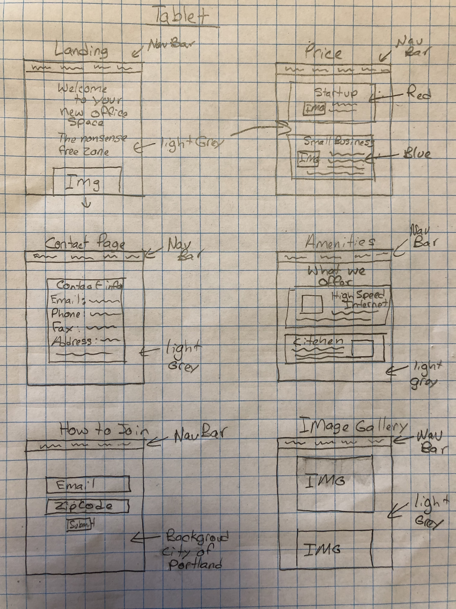
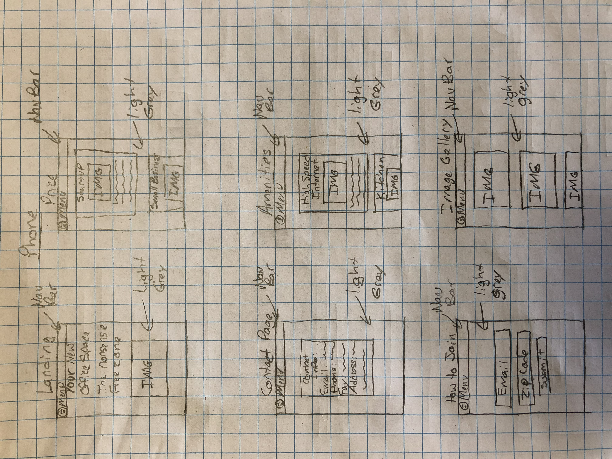

# _Your WorkSpace_

#### _Website to promote a remodeled building for a company/person to buy or rent. February 22nd 2019_

#### By _Nate Wessels with direction from Epicodus_

## Description

_A company has come to us to ask us to build a website promoting their remodeled building. They want the website to reflect their company values. The company want the website to feel luxurious but while being open to everyone. They want to promote the website to all companies not just technology companies._

## User Personas

#### Jeff
  * _"I need a small, but somehwat luxurious building for my growing company"_
  * _Needs: A well organized office space with a company thats friendly, high speed internet, small kitchen_
  * _Pain Points: Not many options in my area, Any option that is available is way to expensive_
  * _How can we server: Making it in-expensive, Making it comfortable_

#### Megyn
  * _"I'm a no-nonsense kind of person, the moment there is any I'm gone and you will be stuck with someone else"_
  * _Needs: Large building, capable of holding 30+ people, high speed internet_
  * _Pain Points: I can find a building to remodel on my own. Tell me why I shouldnt do that_
  * _How can we serve: Be reliable, good customer service_

## Research, Inspire, BrainStorm

_Here is a list of the companies that I researched/looked at:_
  * _TechSpace_
  * _WeWork_
  * _Hera Hub_
  * _Regus_

_When looking at these website they all have the same goal. Helping customers get nice luxurious working spaces for their company. TechSpace, WeWork, and Regus are all going after the same type of customer/company. They are reaching out to those in every industry no matter the size and offering them something better. And most of them are offering special discounts. But Hera Hub is reaching out to a different customer. They are specifically reaching out to women who are just starting a new business. And offer them education to better know how to grow their business. Decision I have made so far:_

  * _No pop-ups of any kind. Regus has at least 3 and it obstructs the users experience._
  * _The background color needs to be a cool color. Some shade of white, grey, or light blue._
  * _The font style should not be in calligraphy, body font needs to be in some font like Times New Roman._

## Sketch Images

## Setup/Installation Requirements

## Known Bugs

_List of Known bugs_

## Support and Contact Details

_For any questions please contact Nate Wessels at nwessels16@gmail.com_

## Technologies Used

_iMac, sketch software on iMac_

### License

_Copyright (c) 2019 Nate Wessels, Epicodus_

_Permission is hereby granted, free of charge, to any person obtaining a copy of this software and associated documentation files (the "Software"), to deal in the Software without restriction, including without limitation the rights to use, copy, modify, merge, publish, distribute, sublicense, and/or sell copies of the Software, and to permit persons to whom the Software is furnished to do so, subject to the following conditions:_

_The above copyright notice and this permission notice shall be included in all copies or substantial portions of the Software._

_THE SOFTWARE IS PROVIDED "AS IS", WITHOUT WARRANTY OF ANY KIND, EXPRESS OR IMPLIED, INCLUDING BUT NOT LIMITED TO THE WARRANTIES OF MERCHANTABILITY, FITNESS FOR A PARTICULAR PURPOSE AND NONINFRINGEMENT. IN NO EVENT SHALL THE AUTHORS OR COPYRIGHT HOLDERS BE LIABLE FOR ANY CLAIM, DAMAGES OR OTHER LIABILITY, WHETHER IN AN ACTION OF CONTRACT, TORT OR OTHERWISE, ARISING FROM, OUT OF OR IN CONNECTION WITH THE SOFTWARE OR THE USE OR OTHER DEALINGS IN THE SOFTWARE._
